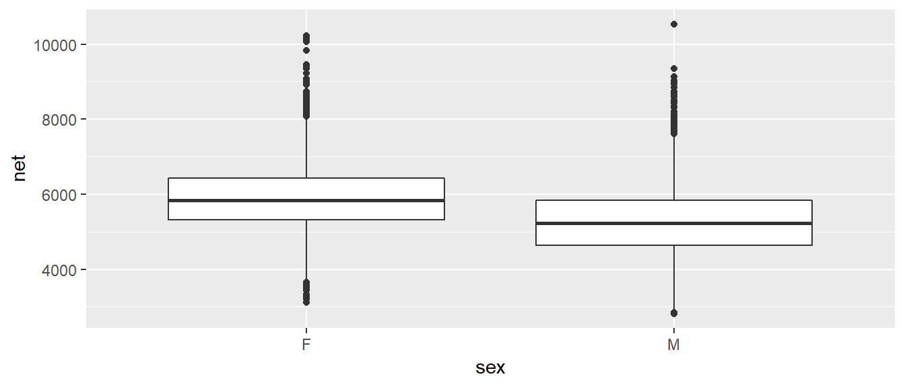
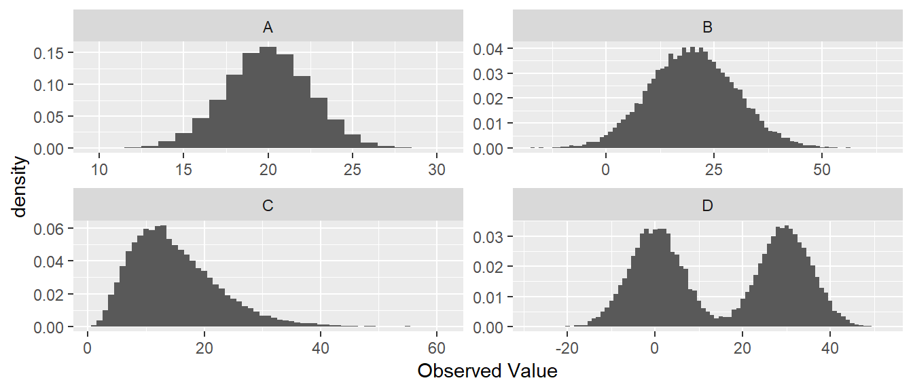

# Summary Statistics and Graphing

When confronted with a large amount of data, we seek to summarize the data into statistics that capture the essence of the data with as few numbers as possible. Graphing the data has a similar goal: to reduce the data to an image that represents all the key aspects of the raw data. In short, we seek to simplify the data in order to understand the trends while not obscuring important structure. 


```r
# Every chapter, we will load all the librarys we will use at the beginning
# of the chapter. These commands will start most every homework assignment
# for this class, and likely, every R script you write.
library(ggplot2)    # graphing functions
library(dplyr)      # data summary tools

# Set default behavior of ggplot2 graphs to be black/white theme
theme_set(theme_bw())
```

For this chapter, we will consider data from a the 2005 Cherry Blossom 10 mile run that occurs in Washington DC. This data set has 8636 observations that includes the runners state of residence, official time (gun to finish, in seconds), net time (start line to finish, in seconds), age, and gender of the runners. 


```r
data(TenMileRace, package='mosaicData')
head(TenMileRace)   # examine the first few rows of the data
```

```
##   state time  net age sex
## 1    VA 6060 5978  12   M
## 2    MD 4515 4457  13   M
## 3    VA 5026 4928  13   M
## 4    MD 4229 4229  14   M
## 5    MD 5293 5076  14   M
## 6    VA 6234 5968  14   M
```

## Variable Types

We will always want to be aware of the variable types in which we are working.  We will distinguish variables into two principal categories: numerical and categorical.

### Categorical

* **Categorical variables** are variables whose elements take on non-numerical entries.  

Examples within the TenMileRace set include the *state* and *sex* variables.  Categorical variables are typically unordered, such that if we chose to order 'NM' before 'AZ' in an evaluation of the *state* variable, there would be no impact on our analysis. Categorical variables that have an implied order are termed **ordinal** variables. Examples include the common A, B, C, D, F grade-scale system.  The variable entries are non-numerical, but there is an implied order that A > B > C > D > F.  Such an ordering could influence the way the data is evaluated.

### Numerical

**Numerical variables** are broadly classified as variables with numerical elements.  Numerical variables within the TenMileRace set include the *time*, *net*, and *age* variables.  Numerical variables are sub-classified as either discrete or continuous.  

* **Discrete variables** have entries that can be written as a list. 

Data that is discrete can take on a countable number of entries, such the variable *age* in years.  We could write a list of numbers, `{0, 1, 2, ..., 122}`[^1], of which all values within the *age* variable could be drawn.  Discrete variables are potentially finite, such as in the previous list for possible values of *age*.  Additional examples include the number of students in a classroom or the number of offspring for a rabbit.  Finite variables have important distributions such as the Binomial distribution.  Discrete variables can also take on a potentially infinite number of possible values, but the values can still be listed, `{0, 1, 2, ...}`.  Although there is no largest value within the list, the number of potential entries is still countable.  Infinite valued discrete variables will also serve the basis for important distributions, such as the Poisson distribution.
     
[^1]: The oldest recorded age was that of a French women, Jeanne Calment, who lived to be to the age of 122 years.
    
* **Continuous variables** have entries that take on numerical values that lie on an interval.  

To decided if a data attribute is discrete or continuous, I often as “Does a fraction of a value make sense?” If so, then the data is continuous.  The variables *time* and *net* are both recorded in seconds, and in this case seem to conform to discrete.  However, if we had instead recorded the minutes with fractions of a minute present, such as 75.25 minutes instead of 4515 seconds, we might realize these variables are more likely to be considered continuous.  Continuous variables constitute a large set of distributions that will be studied, the most commonly known being the Normal distribution.  For the Normal distribution, it is possible to see values ranging from $(-\infty, \infty)$.  This constitutes an interval, albeit a very large interval.  Thus, elements of the variables lie on an interval, and it is not possible to list out all possible entries.  Another simple example will be the Uniform distribution, whose entries lie on the interval `(a,b)`, where `a` and `b` are any real valued number.  Again, all potential observation of the variable can be found in the interval, but it is not possible to list out all possible outcomes.

## Randomization and Sampling

An important aspect of working within statistics is the concept that the data we are working with has been collected randomly.  We think of having a **population**, the collection of all possible observations under consideration.  The population will be dependent on the problem at hand.  In the case of performing a study at a university, it may be that the entire university is the population.  However, you may be working with only a specific subject, in which case the population may be only Mathematics majors.  A **sample** is a subset of the population for which information is gathered.  From the university example, we may choose to collect information from 1,000 students (our sample) which is drawn from the entire university population of 30,000 students (our population).

The way we select our samples is done to ensure that we have randomly collected the data, such that there is no influence of correlation between samples interfering with our analysis.  We will cover three broad sampling techniques that help ensure randomization of the samples collected.

### Sampling Techniques

* **Simple Random Sampling (SRS)** is when every member of the population is equally-likely to be chosen.

For SRS to be used, we also ensure that every member of the population is selected independently.  Let us take the a university of having 30,000 students enrolled to be our population of which we would like to selected 1,000 as a sample.  To use SRS, we would assign every member of the population a value `{1, 2, ..., 30,000}` and then draw numbers, without replacement, from our list of values.  Such random numbers can be drawn using a random number generator, or traditionally through the use of a random number table. Using this method would ensure that we obtain a random sampling drawn from the entire university.  What we cannot do is draw a student, then also draw all of their siblings.  If we were to use such a method, we would be introducing correlation within our samples.  We must ensure that the students are all drawn randomly and that the selection is done independently.

* **Random Cluster Sampling** draws entire clusters based on a division of the population.


## Graphical Summaries

### Univariate - Categorical

If we have univariate data about a number of groups, often the best way to display it is using barplots. They have the advantage over pie-charts that groups are easily compared. 


```r
ggplot(TenMileRace, aes(x=sex)) + geom_bar()
```


One thing that can be misleading is if the zero on the y-axis is removed. In the following graph it looks like there are twice as many female runners as male until you examine the y-axis closely.  In general, the following is a very misleading graph.


```r
ggplot(TenMileRace, aes(x=sex)) + 
  geom_bar() +
  coord_cartesian(ylim = c(4300, 4330))
```


### Univariate - Continuous

A histogram looks very similar to a bar plot, but is used to represent continuous data instead of categorical and therefore the bars will actually be touching. 


```r
ggplot(TenMileRace, aes(x=net)) + geom_histogram()
```


Often when a histogram is presented, the y-axis is labeled as “frequency” or “count” which is the number of observations that fall within a particular bin. However, it is often desirable to scale the y-axis so that if we were to sum up the area $(height * width)$ then the total area would sum to 1. The re-scaling that accomplishes this is $$density=\frac{\#\;observations\;in\;bin}{total\;number\;observations}\cdot\frac{1}{bin\;width}$$
 

### Bivariate - Categorical vs Continuous

We often wish to compare response levels from two or more groups of interest. To do this, we often use side-by-side boxplots. Notice that each observation is associated with a continuous response value and a categorical value. 


```r
ggplot(TenMileRace, aes(x=sex, y=net)) + geom_boxplot()
```


In this graph, the edges of the box are defined by the 25% and 75% percentiles. That is to say, 25% of the data is to the below of the box, 50% of the data is in the box, and the final 25% of the data is to the above of the box. The line in the center of the box represents the 50% percentile. The dots are data points that traditionally considered outliers. We will define the Inter-Quartile Range (IQR) as the length of the box. It is conventional to define any observation more than 1.5*IQR from the box as an considered an outlier.  In the above graph it is easy to see that the median time for the males is lower than for females, but the box width (one measure of the spread of the data) is approximately the same.

Because boxplots simplify the distribution to just 5 numbers, looking at side-by-side histograms might give similar information.


```r
ggplot(TenMileRace, aes(x=net)) +
  geom_histogram() +
  facet_grid( . ~ sex )  # side-by-side plots based on sex
```


Orientation of graphs can certainly matter. In this case, it makes sense to stack the two graphs to facilitate comparisons in where the centers are and it is more obvious that the center of the female distribution is about 500 to 600 seconds higher than then center of the male distribution. 


```r
ggplot(TenMileRace, aes(x=net)) +
  geom_histogram() +
  facet_grid( sex ~ . )  # side-by-side plots based on sex
```


### Bivariate - Continuous vs Continuous

Finally we might want to examine the relationship between two continuous random variables. For example, we might wish to explore the relationship between a runners age and their net time.


```r
ggplot(TenMileRace, aes(x=age, y=net, color=sex)) + geom_point()
```




## Measures of Centrality

The most basic question to ask of any dataset is 'What is the typical value?' There are several ways to answer that question and they should be familiar to most students.

### Mean

Often called the average, or arithmetic mean, we will denote this special statistic with a bar. We define $$\bar{x}=\frac{1}{n}\sum_{i=1}^{n}x_{i}=\frac{1}{n}\left(x_{1}+x_{2}+\dots+x_{n}\right)$$
 

If we want to find the mean of five numbers $\left\{ 3,6,4,8,2\right\}$  the calculation is 
$$\bar{x}	=	\frac{1}{5}\left(3+6+4+8+2\right)
	=	\frac{1}{5}\left(23\right)
	=	23/5
	=	4.6$$
 

This can easily be calculated in R by using the function `mean()`. We first extract the column we are interested in using the notation: `DataSet$ColumnName` where the $ signifies grabbing the column.


```r
# TenMileRace$net  is the set of data to calculate the mean of. 
mean( TenMileRace$net ) # Simplest way of doing this calculation
```

```
## [1] 5599.065
```

```r
# Using the dplyr package we first specify the data set 
# Then specify we wish to summarize() the data set
# The summary we want to do is to calculate the mean of the 'net' column.
# and we want to name what we are about to create as Calculated.Mean
TenMileRace %>% summarise( Calculated.Mean = mean(net) )  
```

```
##   Calculated.Mean
## 1        5599.065
```

### Median

If the data were to be ordered, the median would be the middle most observation (or, in the case that $n$ is even, the mean of the two middle most values).

In our simple case of five observations $\left\{ 3,6,4,8,2\right\}$, we first sort the data into $\left\{ 2,3,4,6,8\right\}$  and then the middle observation is clearly $4$.

In R the median is easily calculated by the function `median()`.


```r
# Use the median() function to calculate the median for us.
# median( TenMileRace$net )
TenMileRace %>% summarise( Median = median(net) ) 
```

```
##   Median
## 1   5555
```

### Mode

This is peak in the distribution. A distribution might have a single peak or multiple peaks.This measure of "center" is not often used in quantitative analyses, but is often helps provide a nice description.

When creating a histogram from a set of data, often the choice of binwidth will affect the modes of the graph.  Consider the following graphs of $n=200$ data points, where we have slightly different binwidths. 


With the two smaller binwidths, sample randomness between adjacent bins obscures the overall shape and we have many different modes. However the *larger* binwidth results in a histogram that more effectively communicates the shape of the distribution and has just a single mode at around 6000 seconds (= 100 minutes = 1 hour 40 minutes). When making histograms the choice of binwidth (or equivalently, the number of bins) should not be ignored and a balance should be struck between simplifying the data too much vs seeing too much of the noise resulting from the sample randomness.

### Examples 

* Suppose a retired professor my father were to become bored and enroll into the the author's STA 570 course, how would that affect the mean and median age of the STA 570 students? 
    + The mean would move much more than the median. Suppose the class has 5 people right now, ages 21, 22, 23, 23, 24 and therefore the median is 23. When the retired professor joins, the ages will be 21, 22, 23, 23, 24, 72 and the median will remain 23. However, the mean would move because we add in such a large outlier. Whenever we are dealing with skewed data, the mean is pulled toward the outlying observations.

* In 2010 during a player's strike in the NFL, the median NFL player salary was $770,000 while the mean salary was $1.9 million. Clearly the player's union would talk about the median while the team owners preferred to talk about the mean. Why is there such a difference? 
    + Because salary data contains outliers (e.g. superstar players with salaries in excess of 20 million) and the minimum salary for a rookie is $375,000. Financial data often reflects a highly skewed distribution and the median is often a better measure of centrality in these cases.

## Measures of Spread

The second question to ask of a dataset is 'How much spread is in the data?' The fancier (and eventually more technical) word for spread is 'variability'. As with centrality, there are several ways to measure this. 

### Range

Range is the distance from the largest to the smallest value in the dataset.


```r
# max( TenMileRace$net ) - min( TenMileRace$net )
TenMileRace %>% summarise( Range = max(net) - min(net) )
```

```
##   Range
## 1  7722
```

In general, this method is highly sensitive to outlier observations and isn't often used.

### Inter-Quartile Range

The p-th percentile is the observation (or observations) that has at most $p$ percent of the observations below it and $(1-p)$ above it, where $p$ is between 0 and 100. The median is the $50$th percentile. Often we are interested in splitting the data into four equal sections using the $25$th, $50$th, and $75$th percentiles (which, because it splits the data into four sections, we often call these the $1$st, $2$nd, and $3$rd quartiles). 

In general we could be interested in dividing the data up into an arbitrary number of sections, and refer to those as quantiles of my data.


```r
quantile( TenMileRace$net ) # gives the 5-number summary by default
```

```
##    0%   25%   50%   75%  100% 
##  2814  4950  5555  6169 10536
```

The inter-quartile range (IQR) is defined as the distance from the $3$rd quartile to the $1$st. 


```r
# IQR( TenMileRace$net )
TenMileRace %>% summarise( CalcIQR = IQR(net) ) 
```

```
##   CalcIQR
## 1    1219
```

Notice that we've defined IQR before when we looked at box-and-whisker plots and this is exactly the length of the box part of a box-and-whisker plot. 

### Variance

One way to measure the spread of a distribution is to ask “what is the typical distance of an observation to the mean?” We could define the $i$th deviate as 
$$e_{i}=x_{i}-\bar{x}$$
and then ask what is the average deviate? The problem with this approach is that the sum (and thus the average) of all deviates is always 0.
$$\sum_{i=1}^{n}(x_{i}-\bar{x})	=	\sum_{i=1}^{n}x_{i}-\sum_{i=1}^{n}\bar{x}
	=	n\frac{1}{n}\sum_{i=1}^{n}x_{i}-n\bar{x}
	=	n\bar{x}-n\bar{x}
	=	0$$
 
The big problem is that about half the deviates are negative and the others are positive. What we really care is the distance from the mean, not the sign. So we could either take the absolute value, or square it. 

There are some really good theoretical reasons to chose the square option. Squared terms are easier to deal with compared to absolute values, but more importantly, the spread of the normal distribution is parameterized via squared distances from the mean. Because the normal distribution is so important, we've chosen to define the sample variance so it matches up with the natural spread parameter of the normal distribution. So we square the deviates and then find the average deviate size (approximately) and call that the sample variance.
$$s^{2}=\frac{1}{n-1}\sum_{i=1}^{n}\left(x_{i}-\bar{x}\right)^{2}$$
 Why do we divide by $n-1$ instead of $n$? 

1. If we divide by $n$, then on average, we would tend to underestimate the population variance $\sigma^{2}$. 
2.  The reason is because we are using the same set of data to estimate $\sigma^{2}$ as we did to estimate the population mean ($\mu$). If we could use   
    $$\frac{1}{n}\sum_{i=1}^{n}\left(x_{i}-\mu\right)^{2}$$
    as the estimator, we would be fine. But because we have to replace $\mu$ with $\bar{x}$ we have to pay a price.
3. Because the estimation of $\sigma^{2}$ requires the estimation of one other quantity, and using using that quantity, you only need $n-1$ data points and can then figure out the last one, we have used one degree of freedom on estimating the mean and we need to adjust the formula accordingly.

In later chapters we'll give this quantity a different name, so we'll introduce the necessary vocabulary here. Let $e_{i}=x_{i}-\bar{x}$ be the error left after fitting the sample mean. This is the deviation from the observed value to the “expected value” $\bar{x}$. We can then define the Sum of Squared Error as 
$$SSE=\sum_{i=1}^{n}e_{i}^{2}$$
and the Mean Squared Error as $$MSE=\frac{SSE}{df}=\frac{SSE}{n-1}=s^{2}$$ where $df=n-1$ is the appropriate degrees of freedom.

Calculating the variance of our small sample of five observations $\left\{ 3,6,4,8,2\right\}$, recall that the sample mean was $\bar{x}=4.6$ 

+-------+-------------------+--------------------+
| $x_i$ |  $(x_i-\bar{x})$  |  $(x_i-\bar{x})^2$ |
+=======+===================+====================+
|  3    |       -1.6        |    2.56            |
+-------+-------------------+--------------------+
|  6    |        1.4        |    1.96            |
+-------+-------------------+--------------------+
|  4    |       -0.6        |    0.36            |
+-------+-------------------+--------------------+
|  8    |        3.4        |   11.56            |
+-------+-------------------+--------------------+ 
|  2    |       -2.6        |    6.76            |
+-------+-------------------+--------------------+
|       |                   |  SSE = 23.2        |
+-------+-------------------+--------------------+
        
and so the sample variance is $$s^2 = \frac{SSE}{n-1} = \frac{23.2}{(n-1)} = \frac{23.2}{4}=5.8$$
 
Clearly this calculation would get very tedious to do by hand and computers will be much more accurate in these calculations. In R, the sample variance is easily calculated by the function `var()`.


```r
ToyData <- data.frame( x=c(3,6,4,8,2) )
# var( ToyData$x )
ToyData %>% summarise( s2 = var(x) )
```

```
##    s2
## 1 5.8
```

For the larger TenMileRace data set, the variance is just as easily calculated.


```r
# var( TenMileRace$net )
TenMileRace %>% summarise( s2 = var(net) )
```

```
##         s2
## 1 940233.5
```

### Standard Deviation

The biggest problem with the sample variance statistic is that the units are in the original units-squared. That means if you are looking at data about car fuel efficiency, then the values would be in mpg$^{2}$ which are units that I can't really understand. The solution is to take the positive square root, which we will call the sample standard deviation. $$s=\sqrt{s^{2}}$$
 But why do we take the jog through through variance? Mathematically the variance is more useful and most distributions (such as the normal) are defined by the variance term. Practically though, standard deviation is easier to think about.

The sample standard deviation is important enough for R to have a function `sd()` that will calculate it for you. 


```r
# sd( TenMileRace$net )
TenMileRace %>% summarise( s = sd(net) )
```

```
##          s
## 1 969.6564
```


### Coefficient of Variation

Suppose we had a group of animals and the sample standard deviation of the animals lengths was 15 cm. If the animals were elephants, you would be amazed at their uniformity in size, but if they were insects, you would be astounded at the variability. To account for that, the coefficient of variation takes the sample standard deviation and divides by the absolute value of the sample mean (to keep everything positive)

$$CV=\frac{s}{\vert\bar{x}\vert}$$


```r
TenMileRace %>% summarise( s = sd(net),
                           xbar = mean(net),
                           cv = s / abs(xbar) )
```

```
##          s     xbar        cv
## 1 969.6564 5599.065 0.1731818
```


```r
# Previously using dplyr notation didn't help too much, but if we wanted
# to calculate the statistics separately for each sex, the dplyr solution
# is MUCH easier.
TenMileRace %>%                     # Summarize the Ten Mile Race Data
  group_by(sex) %>%                 # Subsequent actions are done seperately 
  summarise( xbar = mean(net),      #    for each gender
             s    = sd(net),        #
             cv   = s / abs(xbar) ) # Calculate three different summary stats
```

```
## # A tibble: 2 x 4
##   sex    xbar     s    cv
##   <fct> <dbl> <dbl> <dbl>
## 1 F     5916.  902. 0.152
## 2 M     5281.  930. 0.176
```

### Empirical Rule of Thumb

For any mound-shaped sample of data the following is a reasonable rule of thumb:

|  Interval        |     Approximate percent of Measurements   |
|:----------------:|:-----------------------------------------:|  
| $\bar{x}\pm s$   |               68%                         |  
| $\bar{x}\pm 2s$  |               95%                         |
| $\bar{x}\pm 3s$  |               99.7%                       |


## Shape
We want to be able to describe the shape of a distribution and this section introduces the standard vocabulary.

### Symmetry
A distribution is said to be symmetric if there is a point along the x-axis (which we'll call $\mu$) which acts as a mirror and $f( -|x-\mu| ) = f( |x-\mu| )$.  In the following graphs, the point of symmetry is marked with a red line.


A distribution that is not symmetric is said to be asymmetric.

### Unimodal or Multi-modal
Recall one measure of centrality was mode.  If there is just a single mode, then we refer to the distribution as unimodal. If there is two or more we would refer to it as bimodal or multi-modal.

### Skew
If a distribution has a heavier tail on one side or the other, we refer to it as a *skewed* distribution and the direction of the skew is towards the heavier tail.  Usually (but not always), an asymmetric is skewed. 


## Exercises

1. O&L 3.21. The ratio of DDE (related to DDT) to PCB concentrations in bird eggs has been shown to have had a number of biological implications. The ratio is used as an indication of the movement of contamination through the food chain. The paper “The ratio of DDE to PCB concentrations in Great Lakes herring gull eggs and its us in interpreting contaminants data” reports the following ratios for eggs collected at 13 study sites from the five Great Lakes. The eggs were collected from both terrestrial and aquatic feeding birds.
    
    +-------------------+-----------------------------------------------------------------------+
    |  Source Type      |   DDE to PCB Ratio                                                    |
    +-------------------+-----------------------------------------------------------------------+
    |  **Terrestrial**  | 76.50, 6.03, 3.51, 9.96, 4.24, 7.74, 9.54, 41.70, 1.84, 2.5, 1.54     |
    +-------------------+-----------------------------------------------------------------------+
    |  **Aquatic**      |  0.27, 0.61, 0.54, 0.14, 0.63, 0.23, 0.56,  0.48, 0.16, 0.18          |
    +-------------------+-----------------------------------------------------------------------+
    
    a) By hand, compute the mean and median separately for each type of feeder.
    b) Using your results from part (a), comment on the relative sensitivity of the mean and median to extreme values in a data set.
    c) Which measure, mean or median, would you recommend as the most appropriate measure of the DDE to PCB level for both types of feeders? Explain your answer.

2. O&L 3.31. Consumer Reports in its June 1998 issue reports on the typical daily room rate at six luxury and nine budget hotels. The room rates are given in the following table.
    
    |  Hotel Type   |   Nightly Rate                                       |
    |:-------------:|:----------------------------------------------------:|
    |  Luxury	      |  $175,	$180,	$120,	$150,	$120,	$125                 |
    |  Budget       |  $50,	$50,	$49,	$45,	$36,	$45,	$50,	$50,	$40  |
    
    a) By hand, compute the means and standard deviations of the room rates for each class of hotel.
    b) Give a practical reason why luxury hotels might have higher variability than the budget hotels. (Don't just say the standard deviation is higher because there is more spread in the data, but rather think about the Hotel Industry and why you might see greater price variability for upscale goods compared to budget items.)

3. Use R to confirm your calculations in problem 1 (the pollution data). Show the code you used and the subsequent output. It will often be convenient for me to give you code that generates a data frame instead of uploading an Excel file and having you read it in. The data can be generated using the following commands:
    
    ```r
    PolutionRatios <- data.frame(
      Ratio = c(76.50, 6.03, 3.51, 9.96, 4.24, 7.74, 9.54, 41.70, 1.84, 2.5, 1.54,
                 0.27, 0.61, 0.54, 0.14, 0.63, 0.23, 0.56,  0.48, 0.16, 0.18       ),
      Type  = c( rep('Terrestrial',11), rep('Aquatic',10) ) )
    
    # Print out some of the data to confirm what the column names are
    head( PolutionRatios )
    ```
    
    ```
    ##   Ratio        Type
    ## 1 76.50 Terrestrial
    ## 2  6.03 Terrestrial
    ## 3  3.51 Terrestrial
    ## 4  9.96 Terrestrial
    ## 5  4.24 Terrestrial
    ## 6  7.74 Terrestrial
    ```
    *Hint: for computing the means and medians for each type of feeder separately, the `group_by()` command we demonstated earlier in the chapter is convenient.*

4. Use R to confirm your calculations in problem 2 (the hotel data). Show the code you used and the subsequent output. The data can be loaded into a data frame using the following commands Show the code you used and the subsequent output:
    
    ```r
    Hotels <- data.frame(
      Price = c(175, 180, 120, 150, 120, 125, 50, 50, 49, 45, 36, 45, 50, 50, 40),
      Type  = c( rep('Luxury',6),  rep('Budget', 9) ) )
    
    # Print out some of the data to confirm what the column names are
    head( Hotels )
    ```
    
    ```
    ##   Price   Type
    ## 1   175 Luxury
    ## 2   180 Luxury
    ## 3   120 Luxury
    ## 4   150 Luxury
    ## 5   120 Luxury
    ## 6   125 Luxury
    ```

5. For the hotel data, create side-by-side box-and-whisker plots to compare the prices.

6. Match the following histograms to the appropriate boxplot.
    
    
    
    
    a) Histogram A goes with boxplot __________
    b) Histogram B goes with boxplot __________
    c) Histogram C goes with boxplot __________
    d) Histogram D goes with boxplot __________

7. Twenty-five employees of a corporation have a mean salary of $62,000 and the sample standard deviation of those salaries is $15,000. If each employee receives a bonus of $1,000, does the standard deviation of the salaries change? Explain your reasoning.

8. The chemicals in clay used to make pottery can differ depending on the geographical region where the clay originated. Sometimes, archaeologists use a chemical analysis of clay to help identify where a piece of pottery originated. Such an analysis measures the amount of a chemical in the clay as a percent of the total weight of the piece of pottery. The boxplots below summarize analyses done for three chemicals—X, Y, and Z—on pieces of pottery that originated at one of three sites: I, II, or III.
    
    
    a) For chemical Z, describe how the percents found in the pieces of pottery are similar and how they differ among the three sites.
    b) Consider a piece of pottery known to have originated at one of the three sites, but the actual site is not known.
        i) Suppose an analysis of the clay reveals that the sum of the percents of the three chemicals X, Y, and Z is $20.5\%$. Based on the boxplots, which site—I, II, or III—is the most likely site where the piece of pottery originated? Justify your choice.
        ii) Suppose only one chemical could be analyzed in the piece of pottery. Which chemical—X, Y, or Z— would be the most useful in identifying the site where the piece of pottery originated? Justify your choice.

